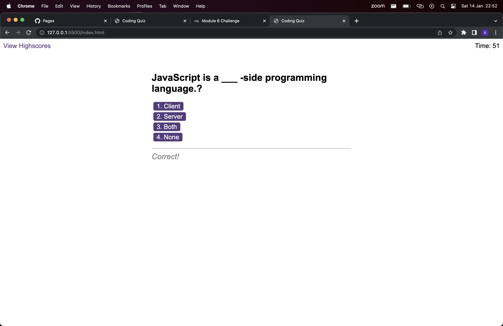

# JavaScript Quiz

## Description 

JavaScript quiz about javascript. You have 75 seconds to answer all questions. After each answer, you get feedback and got presented with another question. If no time is left or all 
questions have been answered, the result page will be displayed where you can insert your initials and see the leaderboard. Keep in mind every time you answer incorrectly 15 seconds are deducted from the timer.

Learn, Explore, Play, Repeat!

:point_right: [Go to Quiz Page](https://aleksandrriabov.github.io/code-quiz/) :point_left:

## Installation
  1. Clone the repository.
  2. Navigate to cloned directory using '__cd code-quiz command.
  3. Open index.html file from terminal, using '__open index.html__' command.

## Screenshot

## Credits

[Aleksandr Riabov](https://github.com/AleksandrRiabov) :clap:

## Technologies used

